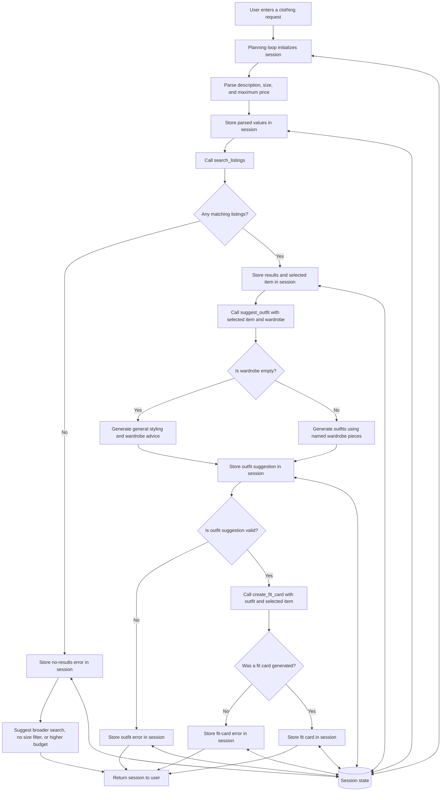

# FitFindr — planning.md

> Complete this document before writing any implementation code.
> Your spec and agent diagram are what you'll use to direct AI tools (Claude, Copilot, etc.) to generate your implementation — the more specific they are, the more useful the generated code will be.
> Your planning.md will be reviewed as part of your submission.
> Update it before starting any stretch features.

---

## Tools

List every tool your agent will use. For each tool, fill in all four fields.
You must have at least 3 tools. The three required tools are listed — add any additional tools below them.

### Tool 1: search_listings

**What it does:**
This tool searches the listings dataset (loaded via load_listings()) for items matching a text description, and optional size and max-price filters. It then scores each listing by keyword overlap with the description and returns matches ranked best-first.

**Input parameters:**
<!-- List each parameter, its type, and what it represents -->
- `description` (str): keywords describing the item the user wants 
- `size` (str| None): this represents size filter for the of the article of clothing; None however skips that size filtering 
- `max_price` (float| None): this represents the max amount of money that the user is willing to pay for the article of clothing; None skips this filter

**What it returns:**
<!-- Describe the return value — what fields does a result contain? -->
A list of matching listing dicts, sorted by relevance (highest keyword-overlap score first). Each dict includes: id, title, description, category, style_tags, size, condition, price, colors, brand, platform. Listings scoring 0 (no keyword overlap) are dropped before returning.

**What happens if it fails or returns nothing:**
<!-- What should the agent do if no listings match? -->
Returns an empty list — it does not raise an exception and does not generate a user-facing message itself. The planning loop is responsible for detecting the empty list and telling the user something like "We don't have any items matching that description."

---

### Tool 2: suggest_outfit

**What it does:**
<!-- Describe what this tool does in 1–2 sentences -->
This tool given a candidate item and the user's wardrobe, asks an LLM to suggest 1–2 complete outfits built around the new item using named pieces from the wardrobe.
**Input parameters:**
<!-- List each parameter, its type, and what it represents -->
- `new_item` (dict): the listing dict returned from search_listings
- `wardrobe` (dict):  a dict with an items key holding a list of wardrobe item dicts; may be empty

**What it returns:**
<!-- Describe the return value -->
A string containing the LLM's outfit suggestion(s). 

**What happens if it fails or returns nothing:**
<!-- What should the agent do if the wardrobe is empty or no outfit can be suggested? -->
If wardrobe['items'] is empty, the tool still calls the LLM, but with a prompt asking for general styling advice for the new item (what it pairs well with, what vibe it suits) or if no outfit could be created due to lack of articles it should give advice on what else they need in their closet to have a full closest 


---

### Tool 3: create_fit_card

**What it does:**
<!-- Describe what this tool does in 1–2 sentences -->
This tool should take in the chosen outfit combination from the user and generate a short trendy shareable description of a complete outfit (suitable for an Instagram/TikTok post.)

**Input parameters:**
<!-- List each parameter, its type, and what it represents -->
- `outfit` (str): ...
- `new_item` (dict): ...

**What it returns:**
<!-- Describe the return value -->
A string caption that mentions the item name, price, and platform once each, captures the outfit's vibe in specific terms, sounds casual/authentic rather than like a product description, and varies between calls (generated with higher LLM temperature).

**What happens if it fails or returns nothing:**
<!-- What should the agent do if the outfit data is incomplete? -->
If outfit is empty or whitespace-only, the tool does not call the LLM — it returns a descriptive error message string (e.g., "Can't generate a fit card without an outfit suggestion") instead of raising an exception.


---

### Additional Tools (if any)

<!-- Copy the block above for any tools beyond the required three -->

---

## Planning Loop

**How does your agent decide which tool to call next?**
<!-- Describe the logic your planning loop uses. What does it look at? What conditions change its behavior? How does it know when it's done? -->
It uses a ReAct-style loop: it reasons about the current session state, acts by calling the appropriate tool, and observes the result before deciding what to do next. First, it parses the user’s query and calls search_listings. If
no listings are returned, it records a helpful error and stops. Otherwise, it selects the highest-ranked listing,
calls suggest_outfit, and then passes the resulting suggestion to create_fit_card. The loop is complete when a fit
card has been generated or when an error prevents the next tool from being called.

---

## State Management

**How does information from one tool get passed to the next?**
<!-- Describe how your agent stores and accesses state within a session. What data is tracked? How is it passed between tool calls? -->
The agent stores information in a session dictionary that acts as the single source of truth for one interaction. It
tracks the original query, parsed search parameters, matching listings, the selected item, the user’s wardrobe, the
outfit suggestion, the final fit card, and any error message. After each tool call, the result is saved in the
session and passed as input to the next tool. For example, the selected result from search_listings is passed to
suggest_outfit, and that outfit suggestion and selected item are then passed to create_fit_card. If a tool fails or
returns no usable result, the error is stored in the session and the agent stops before calling the next tool.


---

## Error Handling

For each tool, describe the specific failure mode you're handling and what the agent does in response.

| Tool | Failure mode | Agent response |
|------|-------------|----------------|
| search_listings | No results match the query | Store a helpful error message in the session and stop the planning loop without calling the remaining tools. Suggest broadening the description, removing the size filter, or increasing the maximum price. |
| suggest_outfit | Wardrobe is empty | Continue without raising an error. Ask the LLM for general styling advice, including pieces that would pair well with the selected item and items the user may want to add to their wardrobe. |
| create_fit_card | Outfit input is missing or incomplete | Do not call the LLM. Return a descriptive error message explaining that a fit card cannot be generated without a valid outfit suggestion. |


---

## Architecture

<!-- Draw a diagram of your agent showing how the components connect:
     User input → Planning Loop → Tools (search_listings, suggest_outfit, create_fit_card)
                                                                          ↕
                                                                   State / Session
     Show what triggers each tool, how state flows between them, and where error paths branch off.
     Use ASCII art or a Mermaid diagram (https://mermaid.js.org/syntax/flowchart.html).
     Do NOT embed an image — graders need to read your diagram directly in the file;
     an embedded image or screenshot cannot be evaluated.
     You'll share this diagram with an AI tool when asking it to implement
     the planning loop and each individual tool. -->



---

## AI Tool Plan

<!-- For each part of the implementation below, describe:
     - Which AI tool you plan to use (Claude, Copilot, ChatGPT, etc.)
     - What you'll give it as input (which sections of this planning.md, your agent diagram)
     - What you expect it to produce
     - How you'll verify the output matches your spec before moving on

     "I'll use AI to help me code" is not a plan.
     "I'll give Claude my Tool 1 spec (inputs, return value, failure mode) and ask it to implement
     search_listings() using load_listings() from the data loader — then test it against 3 queries
     before trusting it" is a plan. -->

**Milestone 3 — Individual tool implementations:**

I will give Claude the specifications for each tool from this document, including the tool’s inputs, expected return
value, and failure behavior. I will ask Claude to implement each function in tools.py while keeping the documented
function signatures unchanged. I will also ask it to add temporary debug output that prints each tool’s inputs and
returned result. I will verify the implementations by running several searches, testing both the example and empty
wardrobes, and testing create_fit_card with missing outfit input. I will inspect the printed output to confirm that
each tool behaves according to its specification before moving on.

**Milestone 4 — Planning loop and state management:**
I will give Claude my Architecture diagram along with the Planning Loop, State Management, and Error Handling
sections of this document. I will ask it to implement the planning loop in agent.py so that each tool is called in
the correct order and its output is stored in the session dictionary. I will also ask Claude to add temporary debug
statements or create a separate local debug file that records the session state after each step. I will inspect this
information to verify that data is passed correctly between tools, successful runs produce a selected item, outfit
suggestion, and fit card, and error conditions stop the loop before invalid tool calls are made.
---

## A Complete Interaction (Step by Step)

Write out what a full user interaction looks like from start to finish — tool call by tool call. Use a specific example query.

**Example user query:** "I'm looking for a vintage graphic tee under $30. I mostly wear baggy jeans and chunky sneakers. What's out there and how would I style it?"

**Step 1:**

The agent creates a new session and parses the following information from the user’s query:

- `description`: `"vintage graphic tee"`
- `size`: `None`
- `max_price`: `30.00`

Then it calls:

```python
search_listings(
    description="vintage graphic tee",
    size=None,
    max_price=30.00,
)
```

This tool searches the listings dataset and returns matching items ranked by keyword relevance.

**Step 2:**

The tool returns a list of items that match the description and price limit. The agent stores these results in the session and selects the top result, such as **Graphic Tee — 2003 Tour Bootleg Style**.

The selected listing contains the following information:

- Size: L
- Condition: Good
- Price: $24
- Platform: Depop

**Step 3:**

The agent stores the selected listing in `session["selected_item"]`. It then calls:

```python
suggest_outfit(
    new_item=selected_item,
    wardrobe=example_wardrobe,
)
```

This tool examines the new item and the pieces in the user’s wardrobe. It creates an outfit using the graphic tee, **Baggy straight-leg jeans, dark wash**, **Chunky white sneakers**, and the **Black crossbody bag**.

**Step 4:**

The agent stores the returned outfit in `session["outfit_suggestion"]`. It then calls:

```python
create_fit_card(
    outfit=outfit_suggestion,
    new_item=selected_item,
)
```

This tool uses the outfit suggestion and listing information to create a short, shareable caption. The caption includes the item’s name, price, platform, and overall outfit vibe.

**Step 5:**

The agent stores the caption in `session["fit_card"]`. Because no errors occurred, the planning loop ends and returns the completed session to the user.

**Final output to user:**

### Top listing found

**Graphic Tee — 2003 Tour Bootleg Style**  
Size: L  
Condition: Good  
Price: $24  
Platform: Depop

### Outfit idea

Pair the graphic tee with your baggy dark-wash jeans and chunky white sneakers for an easy vintage streetwear look. Add your black crossbody bag to keep the outfit practical and tie in the tee’s black color.

### Fit card

Built this look around the Graphic Tee — 2003 Tour Bootleg Style, found for $24 on Depop. Baggy dark-wash jeans and chunky white sneakers give it an effortless vintage-streetwear feel, while the black crossbody keeps everything clean and practical. Faded graphics forever.
